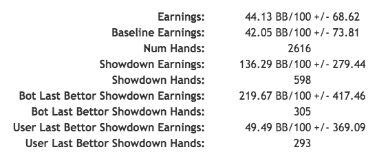
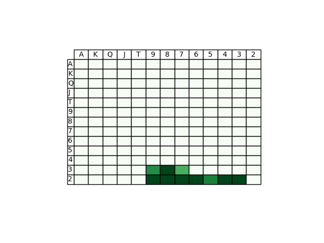
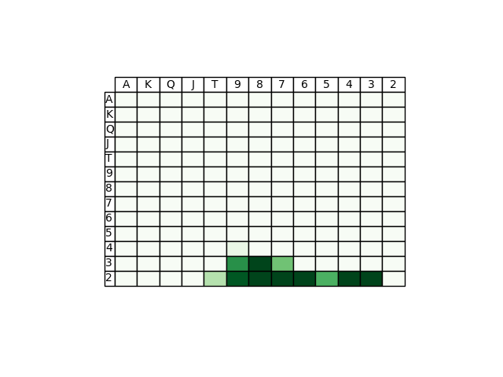
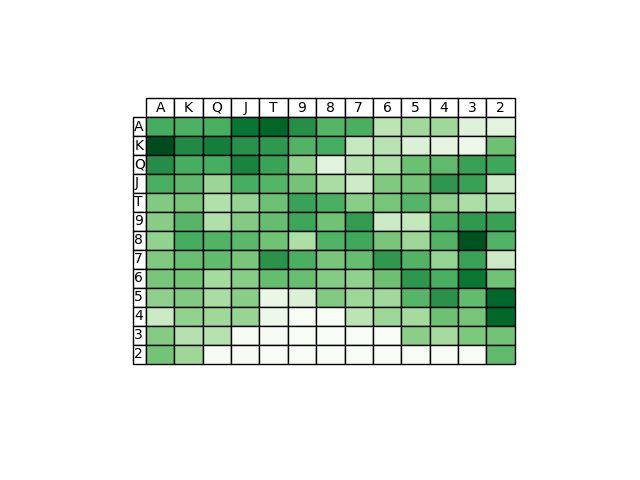
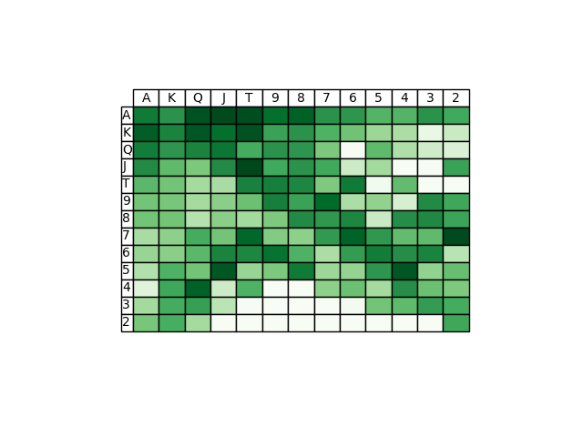
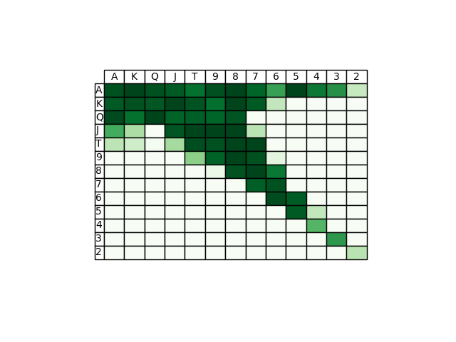
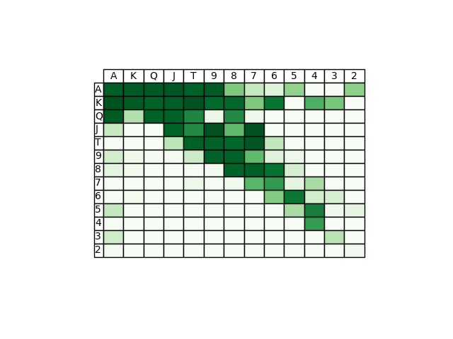

# DeepHoldem

This is an implementation of [DeepStack](https://www.deepstack.ai/s/DeepStack.pdf)
for No Limit Texas Hold'em, extended from [DeepStack-Leduc](https://github.com/lifrordi/DeepStack-Leduc).

## Setup

Running any of the DeepHoldem code requires [Lua](https://www.lua.org/) and [torch](http://torch.ch/). Please install torch with lua version 5.2 instead of LuaJIT. Torch is only officially supported for \*NIX based systems (i.e. Linux and Mac
OS X).

Connecting DeepHoldem to a server or running DeepHoldem on a server will require the [luasocket](http://w3.impa.br/~diego/software/luasocket/)
package. This can be installed with [luarocks](https://luarocks.org/) (which is
installed as part of the standard torch distribution) using the command
`luarocks install luasocket`. Visualising the trees produced by DeepHoldem
requires the [graphviz](http://graphviz.org/) package, which can be installed
with `luarocks install graphviz`. Running the code on the GPU requires
[cutorch](https://github.com/torch/cutorch) which can be installed with
`luarocks install cutorch`.

The HandRanks file was too big for github, so you will need to unzip it: `cd Source/Game/Evaluation && unzip HandRanks.zip`

#### scatterAdd
When you try to run DeepHoldem, you will eventually run into a problem where `scatterAdd` is not defined.
Torch7 actually includes a C++ implementation of scatterAdd but for whatever reason, doesn't include a lua
wrapper for it.

I've included `TensorMath.lua` files in the torch folder of this repository that include the wrapper functions for both CPU and GPU. Copy them to their corresponding torch installation folders.

Now, from your torch installation directory, run:

    ./clean.sh
    TORCH_LUA_VERSION=LUA52 ./install.sh

and you should be good to go.

## Performance

This implementation was tested against Slumbot 2017, the only publicly playable bot as of June 2018. The action abstraction used was half pot, pot and all in for first action, pot and all in for second action onwards. It achieved a baseline winrate of **42bb/100** after 2616 hands (equivalent to ~5232 duplicate hands). Notably, it achieved this playing inside of Slumbot's action abstraction space.

A comparison of preflop ranges was also done against [DeepStack's hand history](https://www.deepstack.ai/s/DeepStack_vs_IFP_pros.zip), showing similar results.

|    |DeepStack | DeepHoldem|
|--- |--- | ---|
|Open fold | | |
|Open pot | | |
|3bet pot after pot open | | |

Average thinking times on NVIDIA Tesla P100:

Street | Thinking Speed (s)
--- | ---
Preflop | 2.69
Flop | 12.42
Turn | 7.57
River | 3.33

Training details:

||# samples | Validation huber loss|
| --- | --- | --- |
|River network|1,000,000| 0.0415|
|Turn network|1,000,000| 0.045|
|Flop network|1,000,000| 0.013|
|Preflop aux network|1,000,000| 0.0017|

## Creating your own models

Other than the preflop auxiliary network, the counterfactual value networks are not included as part of this release, you will need to generate them yourself. The model generation pipeline is a bit different from the Leduc-Holdem implementation in that the data generated is saved to disk as raw solutions rather than bucketed solutions. This makes it easier to experiment with different bucketing methods.

Here's a step by step guide to creating models:

1. `cd Source && th DataGeneration/main_data_generation.lua 4`
2. Wait for enough data to be generated.
3. Modify the last line of `Training/raw_converter.lua` to specify the folders where the raw training data (source folder) you got from step 1 is and where you want the bucketed training data (dest folder) to be.
4. `th Training/raw_converter.lua 4`
5. `th Training/main_train.lua 4`
6. Models will be generated under `Data/Models/NoLimit`. Pick the model you like best and place it inside
   `Data/Models/NoLimit/river` along with its .info file. Rename them to `final_cpu.info` and `final_cpu.model`.
   Please refer to the [DeepStack-Leduc](https://github.com/lifrordi/DeepStack-Leduc/blob/master/doc/manual/tutorial.md) tutorial if you want to convert them to GPU models.
7. Repeat steps 1-6 for turn and flop by replacing `4` with `3` or `2` and placing the models under the
turn and flop folders.

If you want to speed up data generation with a GPU, make sure to modify `Settings/arguments.lua` so that `params.gpu = true`

## Playing against DeepHoldem

`Player/manual_player.lua` is supplied so you can play against DeepHoldem for preflop situations. If you want
DeepHoldem to work for flop, turn and river, you will need to create your own models.

1. `cd ACPCServer && make`
2. `./dealer testMatch holdem.nolimit.2p.reverse_blinds.game 1000 0 Alice Bob`
3. 2 ports will be output, note them down as port1 and port2
4. Open a second terminal and `cd Source && th Player/manual_player.lua <port1>`
5. Open a third terminal and `cd Source && th Player/deepstack.lua <port2>`. It will take about 20 minutes to
load all the flop buckets, but this is actually not necessary until you've created your own flop model. You can
skip the flop bucket computation by commenting out line 44 of `Source/Nn/next_round_value_pre.lua`.
6. Once the deepstack player is done loading, you can play against it using manual_player terminal. `f` = fold,
`c` = check/call, `450` = raise my total pot commitment to 450 chips.

## Differences from the original paper

- A river model was used instead of solving directly from the turn
- Different neural net architecture
  - Batch normalization layers were added in between hidden layers because they were found to improve huber loss
  - Only 3 hidden layers were used. Additional layers didn't improve huber loss, in agreement with the paper.
- Preflop solving was done with auxiliary network only, whereas paper used 20 iterations of flop network
  - Because of this, the cfvs for a given flop must be calculated after seeing it by solving the preflop again with the current flop in mind
- During re-solving, the opponent ranges were not warm started

## Future work

- Warm start opponent ranges for re-solving
- Cache flop buckets so initializing next_round_value_pre doesn't take 20 minutes
- Speed up flop solving (use flop network during preflop solving?)
- Support LuaJIT
- C++ implementation?
